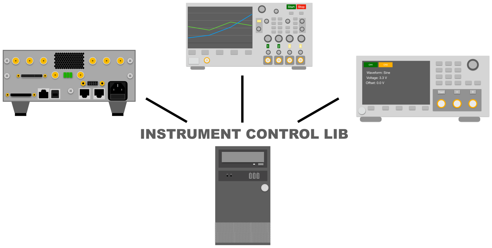

# Instrument Control Lib




This repository contains the code to configure oscilloscopes, signal generators, DC Power-supplies and other measurement
devices.
<br><br>
It provides following functionality:
<br>

- Establishing a network connection and identifying the different types of devices
  <br>
- Execution of VISA commands on the devices. E.g. setting the voltage on a DC power-supply, Setting voltage limits on
  SMUs or to gather the current data of an oscilloscope
  <br>
- CSV export function to directly store the output of measure devices in an *.csv file.
  <br>
- Environment to set up test cases, configured by an XML file.
  <br>
- Platform independent implementation (tested on Windows, MAC OS and Ubuntu)

## Supported Devices

#### &nbsp;&nbsp;&nbsp;&nbsp;- SPD1305X DC Power Supply

#### &nbsp;&nbsp;&nbsp;- Keysight 33500B Waveform Generator

#### &nbsp;&nbsp;&nbsp;- Keysight InfiniiVision 3000A X-Series Oscilloscopes

#### &nbsp;&nbsp;&nbsp;- Tektronix 2600B Series SMU

## Documentation
See [https://florianfrank.github.io/instrument_control_lib/index.html]() for an overview of all available operations and
further documentation. This documentation is built automatically, so it is always up to date.

## Continuous integration

|       OS       |                                                          Status                                                          | 
|:--------------:|:------------------------------------------------------------------------------------------------------------------------:|
| Windows Latest |  |
| Mac OS Latest  |    |
| Ubuntu Latest  |    |

## Build

### 1. Build from master branch

#### 1.1 Checkout repository

```
git clone git@github.com:FlorianFrank/instrument_control_lib.git
```

#### 1.2 Configure build

Adjust the configuration files according to your needs.

```
option(INSTRUMENT_LIB_BUILD_STATIC "Build instrument lib as static library"     ON)

# Definitions for the platform independent abstraction layer.
option(PIL_COMMUNICATION    "Enable PIL Sockets"          ON)
option(PIL_THREADING        "Enable PIL Threads"          ON)
option(PIL_LOGGING          "Enable Logging support"      ON)
option(PIL_SHARED           "BUILD PIL as shared library" OFF)
option(PIL_STATIC           "BUILD PIL as static library" ON)
option(PIL_CXX              "Enable PIL C++ support"      ON)

# PugiXML options
option(BUILD_SHARED_LIBS    "Build pugiXML as shared lib" OFF)
set(PUGI_XML_VERSION 1.12)
```

#### 1.3 Build the library

On Linux and MAC OS run:

```bash
./build.sh
```

On Windows run:

````powershell
.\build.bat
````

#### 1.4 Exporting the library

You can find the library in the **build** folder.

```
out
├── include          Here you can find the device and include fines for the project
├── ĺib              Here you can find the libraries to link to your project.
├── bin              In this folder you can find sample test programs, like a command line interface.
├── doc              This folder contains the doxygen documentation.
```

### 2. Download pre-installed packages

#### 2.1 Download a released version from github.

Go to:<br>
[Instrument Control Packages](https://github.com/FlorianFrank/instrument_control_lib/tags) and download the preferred
version.

#### 2.2 Install the package

#### 2.2.1 On Debian based systems

Execute:

```
dpkg -i instrument_control_lib.deb
```

The files are copied into the **/usr/bin, /usr/lib/,** and **/usr/include** folders and can be linked and included in
any program.

#### 2.2.2 On Windows systems

Run the graphical installer.

#### 2.2.3 On MAC OS systems

Run the graphical installer.

## Supported Commands per device

[comment]: <> (TODO: Maybe remove the section and point to GH pages?)

#### SPD1305X DC Power Supply

| **Function** | **Parameters**   | **Description**                                          | **Value Range** |
|--------------|------------------|----------------------------------------------------------|-----------------|
| setCurrent() | channel, current | Sets the current of the DC power-supply.                 | See manual.     |
| getCurrent() | channel          | Get the currently adjusted current of a certain channel. | See manual.     |
| setVoltage() | channel, voltage | Sets the voltage on the DC power-supply.                 | See manual      |
| getVoltage() | channel          | Get the currently adjusted voltage of a certain channel. | See manual      |

<br>

#### Keysight 33500B Waveform Generator

| **Function**        | **Parameters**        | **Description**                                                                                                                                               | **Value Range**                                                |
|---------------------|-----------------------|---------------------------------------------------------------------------------------------------------------------------------------------------------------|----------------------------------------------------------------|
| run()               | -                     | Start the acquisition on the instrument.                                                                                                                      | -                                                              |
| stop()              | -                     | Stop the acquisition on the instrument.                                                                                                                       | -                                                              |
| single()            | -                     | Wait for the first signal which is triggered and stop the measurement.                                                                                        | -                                                              |
| autoScale()         | -                     | The oscilloscope tries to find the best vertical channel, timebase and trigger setting for the current experiment.                                            | -                                                              |
| setTimeRange()      | timeRange             | Sets the full-cale horizontal time in seconds for the main window.                                                                                            | 10x current time-per-devision setting                          |
| setChannelOffset()  | channel, offset, unit | Set the offset of a channel in volts or milli volts.                                                                                                          | When amplitude is below 400 mV the offset is limited to 500 mV |
| setChannelScale()   | channel, scale        | Sets the vertical scale or units per division of a specified channel.                                                                                         | See manual                                                     |
| setChannelRange()   | channel, range        | Defines the full-scale vertical axis on the selected channel                                                                                                  | 8 mV - 40 V                                                    |
| getWaveFormData()   | data                  | Return the currently captured waveform, which is visualized on the oscilloscopes screen. The data is formated in IEEE 488.2 arbitrary block data format.      | -                                                              |
| getRealData()       | double **result       | Captures data from the oscilloscope and transforms the data from binary array to a double array.                                                              | -                                                              |
| digitize()          | -                     | Specialized run command. Captures waveforms according to the settings of the :ACQuire format. (Can only be executed with :TIMbased:MODE being MAIN or WINDow) | -                                                              |
| getSystemSetup()    | -                     | Outputs the current oscilloscope setup as string.                                                                                                             | -                                                              |
| setDisplayMode()    | mode                  | Sets the mode of the oscilloscope either to normal mode, time based mode, XY or roll mode.                                                                    | NORMAL, TIME_BASED; XY, ROLL                                   |
| setChannelDisplay() | channel               | Turns the output of a channel on or off.                                                                                                                      | ON / OFF                                                       |

<br>

#### Tektronix 2600B Series SMU

| **Function**              | **Parameters**            | **Description**                                                                  | **Value Range** |
|---------------------------|---------------------------|----------------------------------------------------------------------------------|-----------------|
| turnOn()                  | channel                   | Enable a channel on the SMU.                                                     | See manual      |
| turnOff()                 | channel                   | Disable a channel on the SMU.                                                    | See manual      |
| measure()                 | channel, unit             | Measure a certain unit (voltage, current, power) and return the measure results. | See manual      |
| setLevel()                | channel, unit             | Set voltage, current source level                                                | See manual      |
| setLimit()                | channel, unit             | Set voltage, current or power limit.                                             | See manual      |
| enableMeasureAutoRange()  | unit, channel             | Enable voltage or current measure auto range.                                    | ON              |
| disableMeasureAutoRange() | unit, channel             | Disable voltage or current measure auto range.                                   | OFF             |
| enableSourceAutoRange()   | unit, channel             | Enable voltage or current measure auto range.                                    | ON              |
| disableSourceAutoRange()  | unit, channel             | Disable voltage or current measure auto range.                                   | OFF             |
| setMeasureRange()         | unit, channel, range      | Set voltage or current measure range.                                            | See manual      |
| setSourceRange()          | unit, channel, range      | Set voltage or current source range.                                             | See manual      |
| setSenseMode()            | unit, channel, sense-mode | Select local sense (2-wire) remote sense (4-wire) or calibration mode.           | See manual      |
| enableBeep()              | -                         | Enable the execution of a beep sound on the oscilloscope.                        | See manual      |
| enableBeep()              | -                         | Disable the execution of a beep sound on the oscilloscope.                       | See manual      |
| beep()                    | -                         | Send a beep signal to the SMU.                                                   | See manual.     |

<br>

#### Keysight 33500B Waveform Generator

| **Function**        | **Parameters**     | **Description**                                                                                                                     | **Value Range** |
|---------------------|--------------------|-------------------------------------------------------------------------------------------------------------------------------------|-----------------|
| turnOn()            | channel            | Turn on the channel (A or B) on the function generator.                                                                             | -               |
| turnOff()           | channel            | Turn off the channel (A or B) on the function generator.                                                                            | -               |
| setFrequency()      | channel, frequency | Set a certain frequency on a channel of the function generator.                                                                     | See manual      |
| setAmplitude()      | channel, amplitude | Set a certain amplitude on a channel of the function generator.                                                                     | See manual      |
| setOffset()         | channel, offset    | Set a voltage offset on a certain channel of the function generator.                                                                | See manual      |
| setPhase()          | channel, phase     | Adjust the phase on a certain function generator channel.                                                                           | See manual      |
| setFunction()       | funcType           | Set the function currently used (allowed: sinus, square, ramp, negative ramp, triangle, noise, pseudo random bit stream, arbitrary) | See manual      |
| display()           | text               | Display text on display of function generator.                                                                                      |                 |
| displayConnection() | -                  | -                                                                                                                                   | -               |

## Examples

See the [examples](./examples) directory for samples on how to use this lib with C++ and with Python.

### Connect to devices

```c++
#include "kst33500.h" // include right device header file

int main() {
    // provide a IP address, some devices may need an extra port parameter
    KST33500 k("xx.xx.xx.xx", <timeout>); 
    k.Connect();
}
```

## Development

In this lab, we use sockets to send SCPI commands to devices in order
control them remotely.   
Check the documents in [Docs](./docs%20and%20specs) for SCPI commands.

Basically, you can run any commands using Exec commands. For saving time,
we wrapped some frequently used commands. But we cannot wrap all the commands.

Here is an instruction for wrapping a command. Let's say you want to wrap a
command of Keysight waveform generator:

```c++
FUNCtion <function>
```

which sets a <function> waveform.   
Go to kst33500.h file and add a function signature called "function".

```c++
int function(string fun);
```

Go to kst33500.cpp file and add the implementation of this function.
What you need to do is making an SCPI command and invoke the Exec function.

```c++
int KST33500::function(string fun) {
    string msg = "FUNCtion " + fun;
    Exec(msg);
    return 0;
}
```

That's it. After that, you can use it like this:

```c++
k.function("SIN");
```

## Tutorial Python interface

1. Easy installation with pip.

    Execute `pip install .` in the root directory to install the instrument control lib for the current python
    installation. You can now just import py_instrument_control_lib and use it just like the C++ lib. With the pip
    installer the lib now supports autocompletion and type hints.

2. Open the python console
    1. Make sure you installed the lib using pip
    2. Open the library as module
    3. Create a SMU object with an IP and an timeout for the socket
    4. Connect to the SMU
    5. You can check the error code which should be ERROR_CODE.NO_ERROR
        - All defined error codes are listed below

  ```bash
$ python3
>>> from py_instrument_control_lib import *
>>> smu = KEI2600("192.168.1.10", 2000, SEND_METHOD.DIRECT_SEND)
>>> error_code = smu.connect()
>>> print(error_code)
ERROR_CODE.NO_ERROR
>>> device_identifier = smu.getDeviceIdentifier()
>>> print(device_identifier)
Keithley Instruments Inc*, Model 2636B, 4031
>>> error_code = smu.setLevel(SMU_UNIT.VOLTAGE, SMU_CHANNEL.CHANNEL_A, 3.3, False)
>>> if error_code != ERROR_CODE.NO_ERROR: 
          pass  # stop execution or do some error handling
>>> error_code = smu.setLimit(SMU_UNIT.VOLTAGE, SMU_CHANNEL.CHANNEL_A, 5.0, False)
>>> # error handling
>>> error_code = smu.turnOn(SMU_CHANNEL.CHANNEL_A, False)
>>> # error handling
>>> measure_value = smu.measure(SMU_UNIT.CURRENT, SMU_CHANNEL.CHANNEL_B, False)
  >>> print(measure_value)
3.04
  >>> smu.disconnect()
  ```

### Functions

This list gives an overview of the smu functions and how to call them.

```python
# Establish the connection to the device
error_code = smu.connect()
error_code = smu.disconnect()

error_code = smu.turnOn(SMU_CHANNEL.CHANNEL_A, False)
error_code = smu.turnOff(SMU_CHANNEL.CHANNEL_A, False)

value = smu.measure(SMU_UNIT.CURRENT, SMU_CHANNEL.CHANNEL_A, False)
value = smu.measure(SMU_UNIT.VOLTAGE, SMU_CHANNEL.CHANNEL_A, False)
value = smu.measure(SMU_UNIT.RESISTANCE, SMU_CHANNEL.CHANNEL_A, False)
value = smu.measure(SMU_UNIT.POWER, SMU_CHANNEL.CHANNEL_A, False)

error_code = smu.setLevel(SMU_UNIT.VOLTAGE, SMU_CHANNEL.CHANNEL_A, 3.3, False)
error_code = smu.setLevel(SMU_UNIT.CURRENT, SMU_CHANNEL.CHANNEL_A, 0.1, False)

error_code = smu.setLimit(SMU_UNIT.VOLTAGE, SMU_CHANNEL.CHANNEL_A, 3.3, False)
error_code = smu.setLimit(SMU_UNIT.CURRENT, SMU_CHANNEL.CHANNEL_A, 0.1, False)

error_code = smu.enableMeasureAutoRange(SMU_UNIT.VOLTAGE, SMU_CHANNEL.CHANNEL_A, False)
error_code = smu.enableMeasureAutoRange(SMU_UNIT.CURRENT, SMU_CHANNEL.CHANNEL_A, False)

error_code = smu.disableMeasureAutoRange(SMU_UNIT.VOLTAGE, SMU_CHANNEL.CHANNEL_A, False)
error_code = smu.disableMeasureAutoRange(SMU_UNIT.CURRENT, SMU_CHANNEL.CHANNEL_A, False)

error_code = smu.enableSourceAutoRange(SMU_UNIT.VOLTAGE, SMU_CHANNEL.CHANNEL_A, False)
error_code = smu.enableSourceeAutoRange(SMU_UNIT.CURRENT, SMU_CHANNEL.CHANNEL_A, False)

error_code = smu.disableSourceAutoRange(SMU_UNIT.VOLTAGE, SMU_CHANNEL.CHANNEL_A, False)
error_code = smu.disableSourceAutoRange(SMU_UNIT.CURRENT, SMU_CHANNEL.CHANNEL_A, False)

smu.setSenseMode(SMU_CHANNEL.CHANNEL_A, SMU_SENSE.LOCAL, False)

error_code = smu.setSourceRange(SMU_UNIT.VOLTAGE, SMU_CHANNEL.CHANNEL_A, 3.0, False)

device_description = smu.getDeviceIdentifier()
```

### Error codes

There is a function which transforms the error codes into Strings.
Some error codes are not used in the library because these are derived from the abstraction library.
**This function will be implemented in python soon!**

```python
# No error occurred
NO_ERROR
# Invalid arguments passed to a function, e.g. passing a nullptr.
PIL_INVALID_ARGUMENT
# An error occured and an errno error code was set. 
# Internal error message can be requested by the error handle
ERRNO
# Error when performing an operation on a closed interface.
INTERFACE_CLOSED
# Error when baudrate cannot be set. E.g. when the approximation function has a higher deviation then 2 %.
INVALID_BAUDRATE
# Error insufficient resources.
INSUFFICIENT_RESOURCES
# Error, insufficient permissions to perform a certain operation.
INSUFFICIENT_PERMISSIONS
# Error, when deadlock is detected in a multithreaded application.
DEADLOCK_DETECTED
# Error while joining a thread.
THREAD_NOT_JOINABLE
# Error performing an operation on on a not initialized thread.
THREAD_NOT_FOUND
# Error entire file could not be written.
ONLY_PARTIALLY_READ_WRITTEN
# Error no such file or directory.
NO_SUCH_FILE
# Invalid error code.
UNKNOWN_ERROR
# Error while parsing an XML file.
XML_PARSING_ERROR
```
